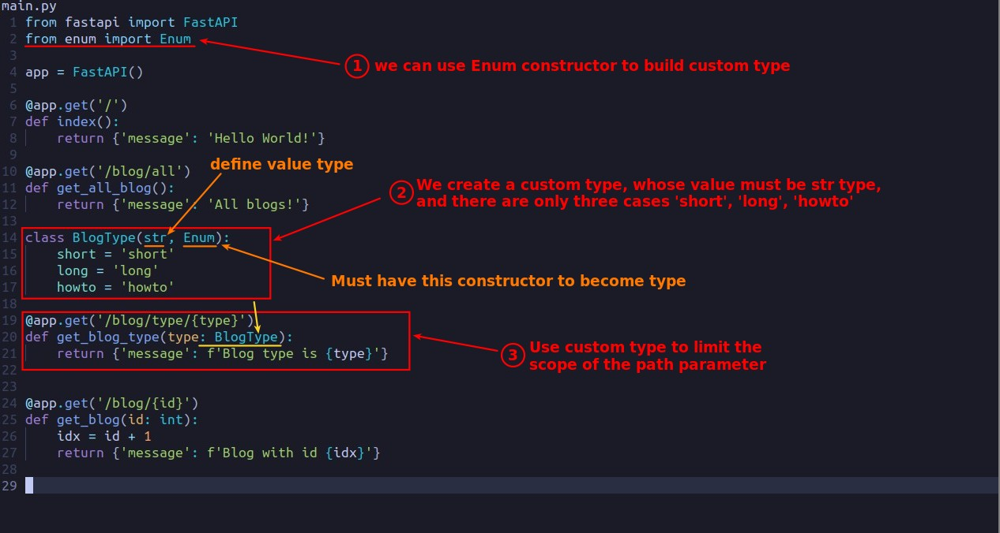
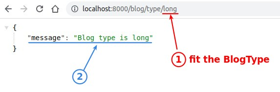
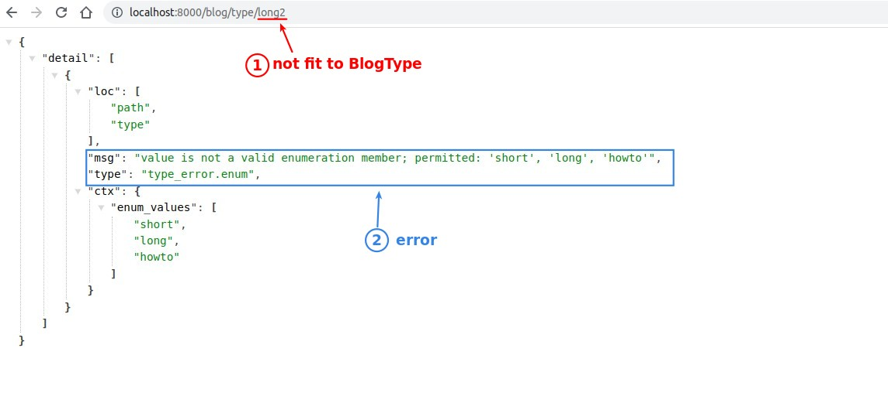

## **Build Custom Type with Enum constructor**

> Sometimes we have to restrict the value of the path parameter to a certain range, so we can use the custom type.

## **TEST**

## **Swagger**

> We can also directly see if the result of the swagger documents is the same as we expected.

