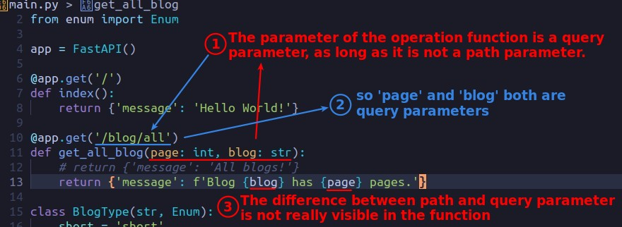
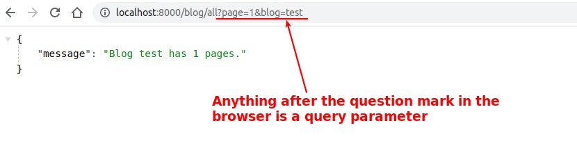
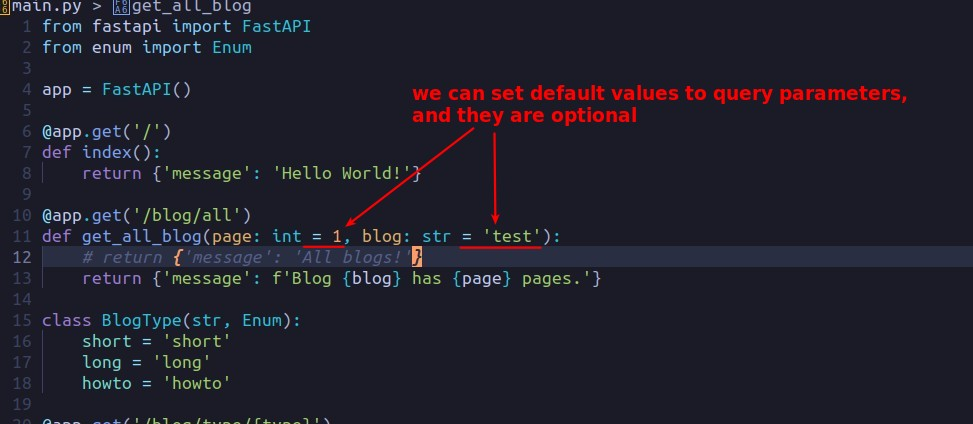
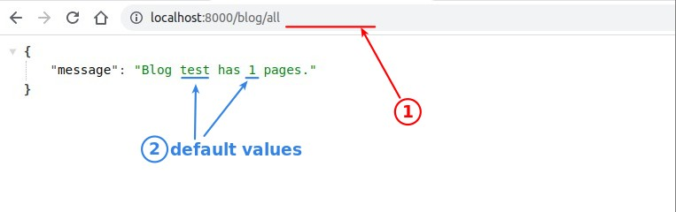
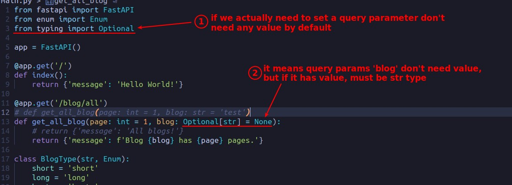
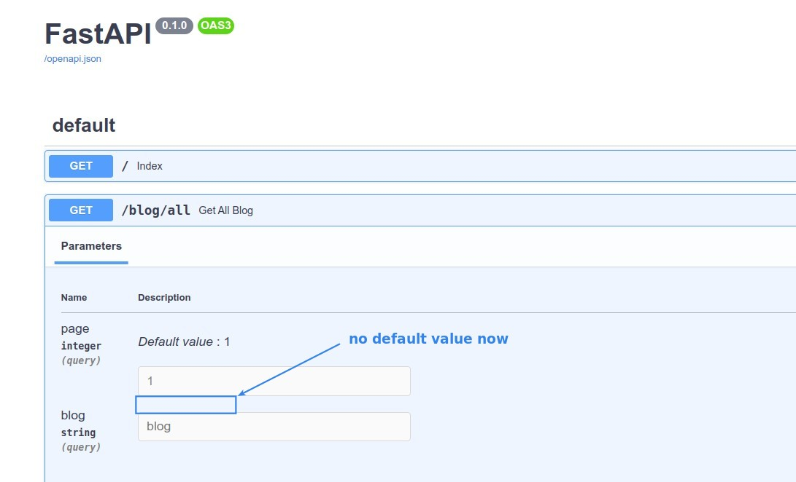

## **Query parameter**

> In addition to the path parameter, there is another parameter - query parameter.

- So the difference between the two is mainly in the way they are entered in the browser url, there is no difference in the use of the operation function.

## **Default value**

## **Optional type**

> If a query parameter must be optional, and cannot have a default value...

