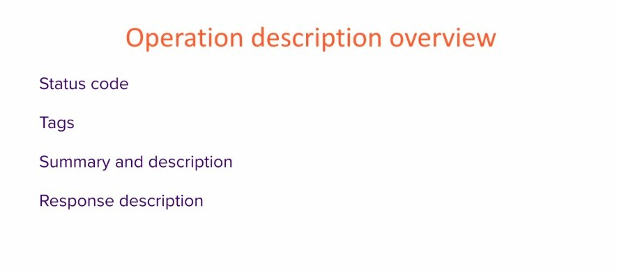

## **Overview**

### _status code_

- Let the user know the result of the request by code.

### _Tags_

- basically are a way to structure our endpoints in different logical way.

### _Summary and description_

- textually describe our endpoints and what exactly they do.

### _Response description_

- tell client what kind of response they can expect.
