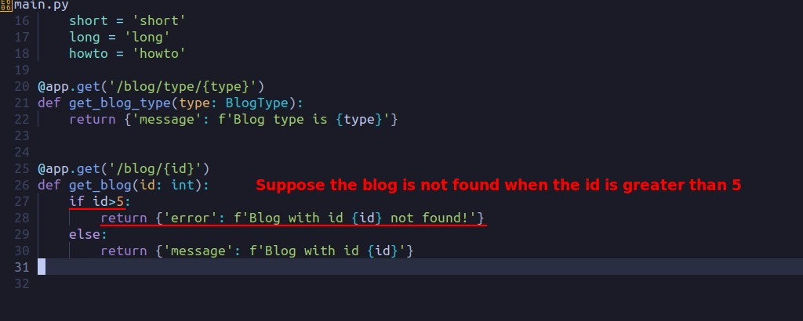
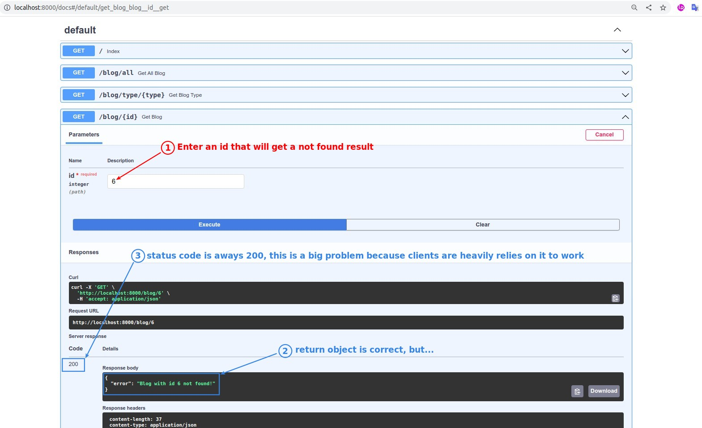
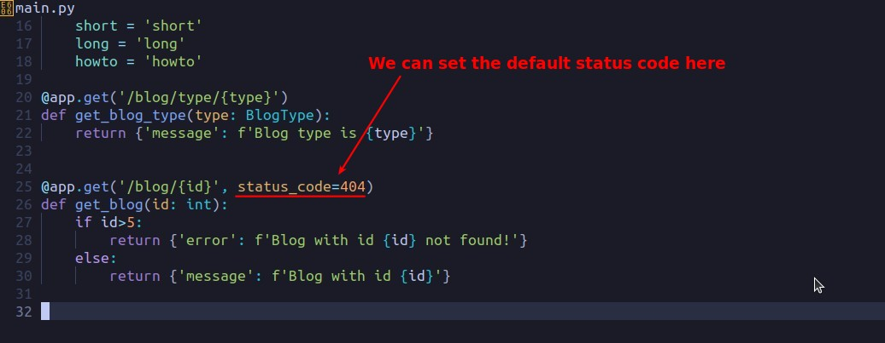
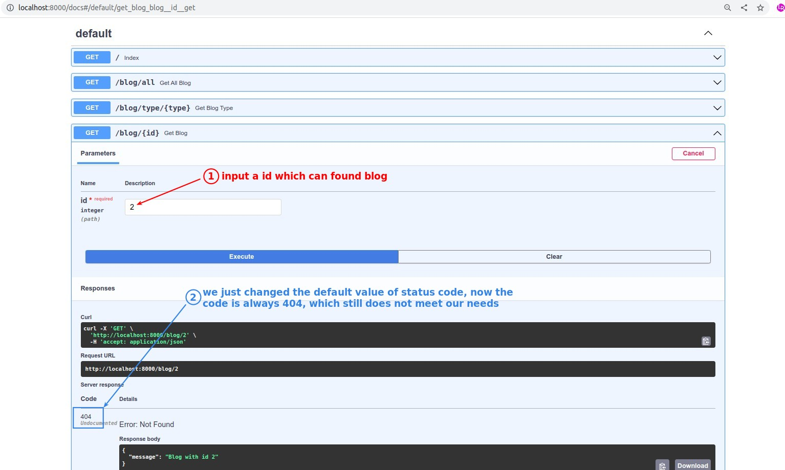
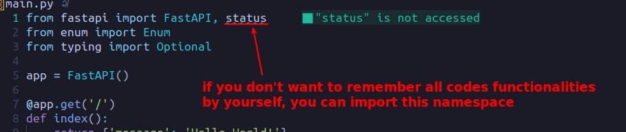
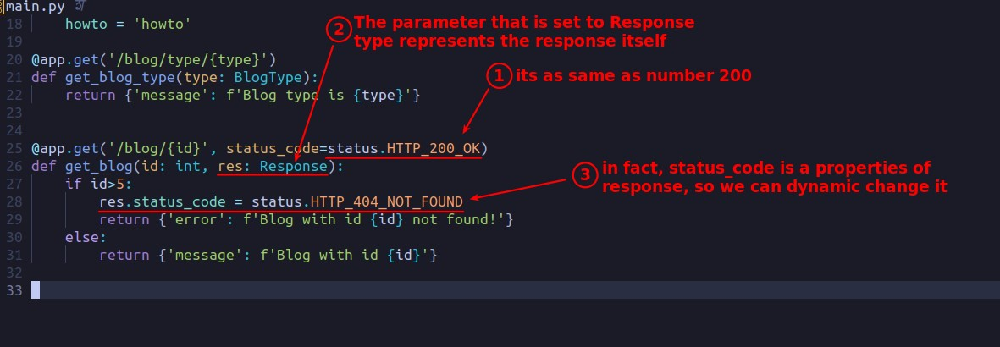
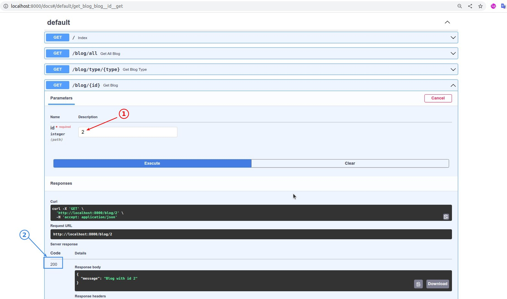
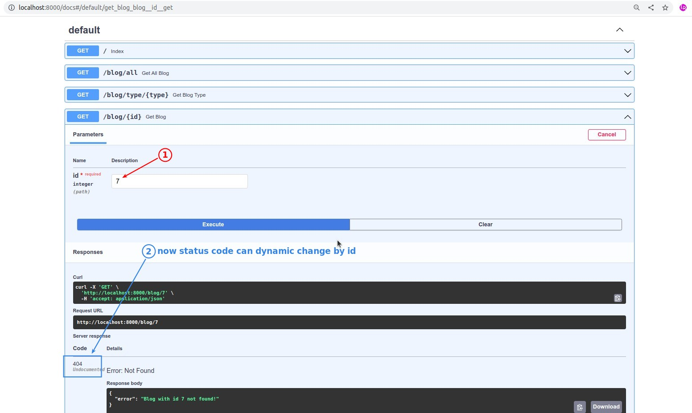

## **Adding error scenarios**

- will automatically generate status code 200, if nothing is set.
- The status code represents the result of the operation function.
  - The client-side application relies a lot on the status code to determine what follow-up actions to take.

## **Set default status code**

- Obviously what we need is the ability to dynamically switch the status code based on the id value, so the default value is not enough.

## **status ns and Response type**

### _status ns_

### _Response type_

### _test_

