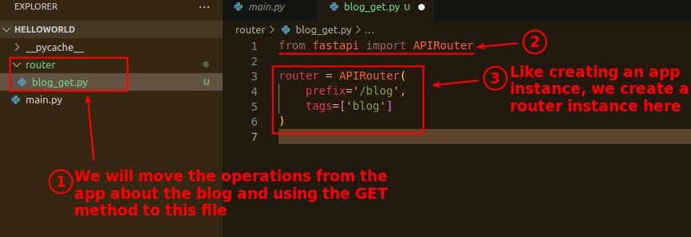
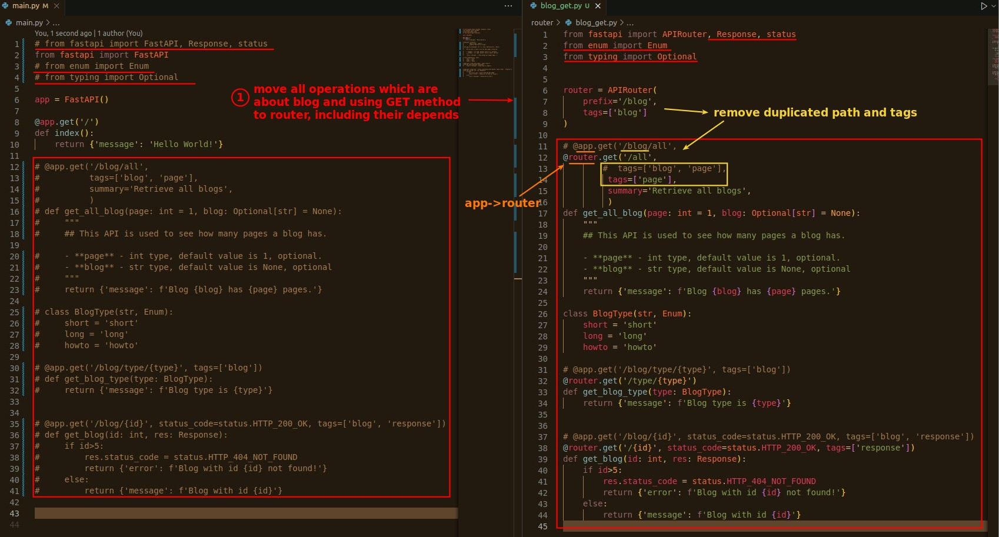
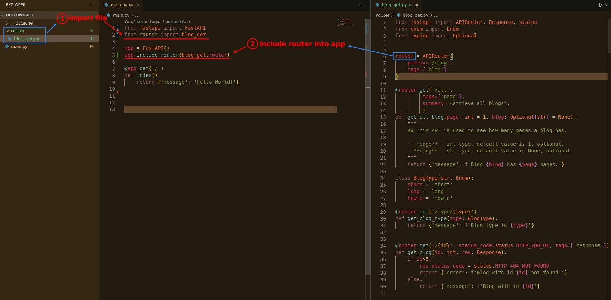
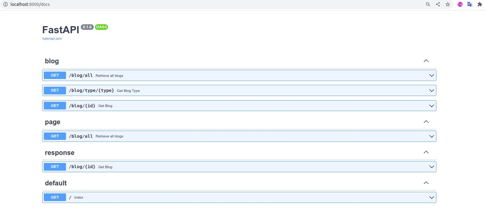

## **Create folder/file and router instance**

- The prefix and tags defined here will be contained in all operations created with it.

## **Move operations from app to router**

## **Include router to app**

## **Check Swagger**

> If it works properly, you should be able to see all previous operations in Swagger documents.

