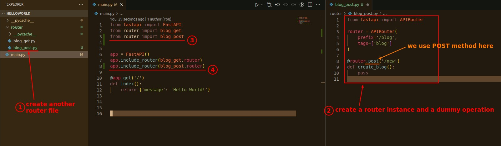
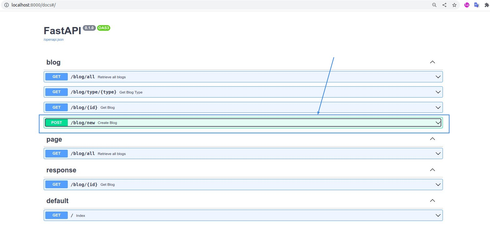

## **Create another router**

> This is to create multiple routers for practice, and to prepare for the next chapter.

- We are learning by different methods, so it is meaningful to use the method for classification, and the meaningfulness of the classification depends on the respective project, there is no right or wrong.

## **Check Swagger documents**

