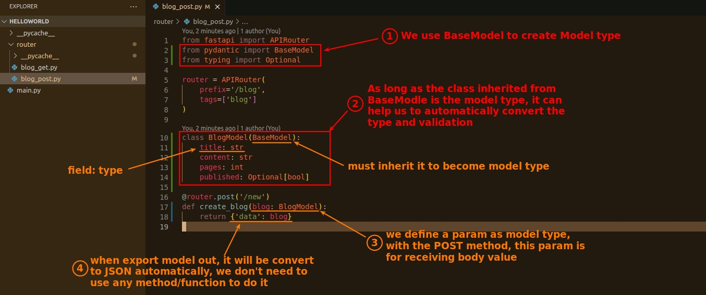
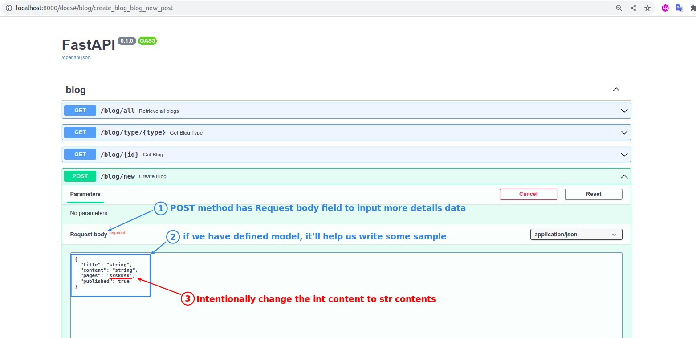
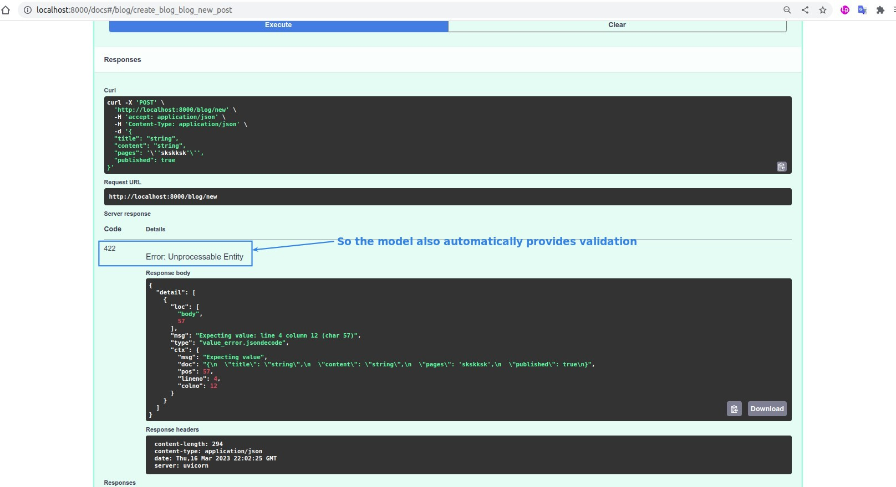

## **Build Model for request body**

- What benefits does model give us?
  - type convert
    - When the API receives data, it automatically converts the data into an object, and each property in the object is converted to a type according to the definition.
    - When the API outputs data, it automatically converts the model data to JSON.
  - type/field validation
  - automatically to read request body.

## **Swagger test**

