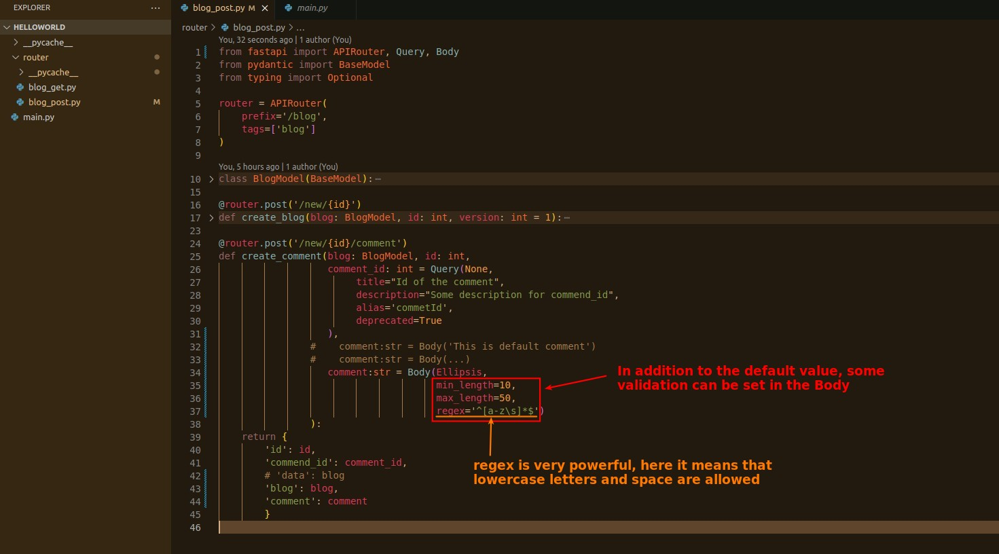

## **Body**

### _default/optional_

### _required_

> Sometimes you want the parameter to be required, not optional, how to handle it?

### _validations_

> In addition to the default value, Body also provides some parameters to enable some validation functionalities.

