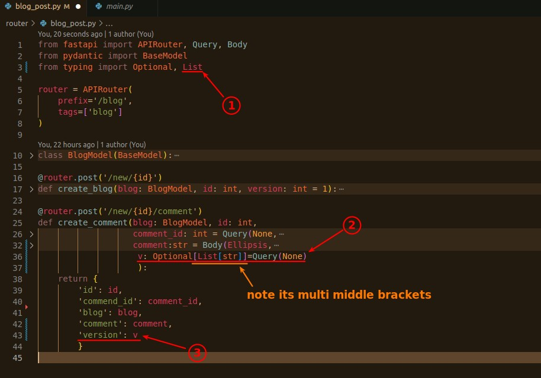
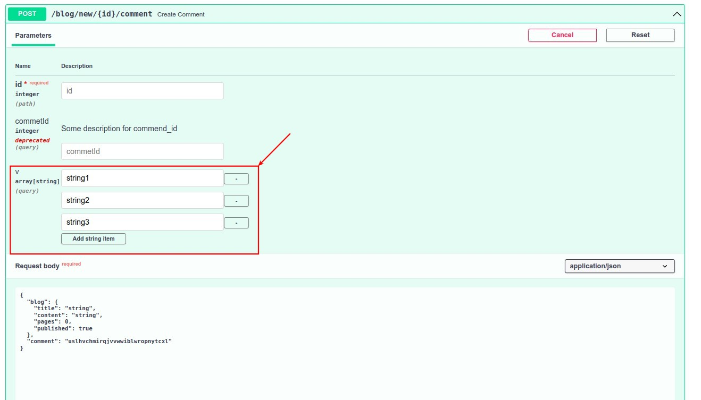
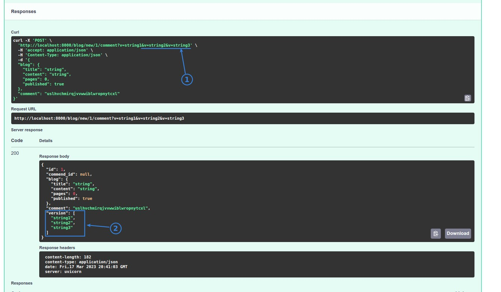
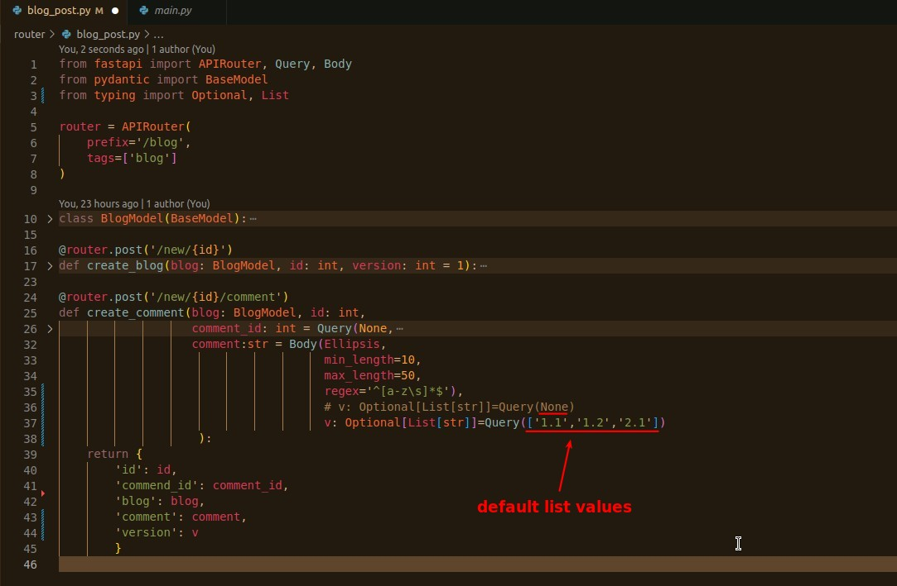
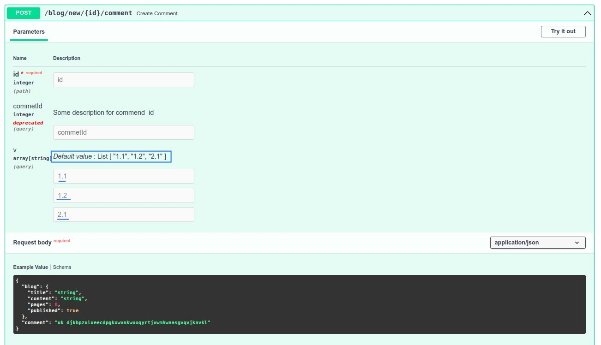

# **_Multiple Parameters_**

> Only the Query parameter can have multiple values, which will be presented as List type in the backend of fastapi.
> (However, the body parameter can also be set multiple times in the model, but it will be wrapped as a single object or JSON)

## **Model List type**

## **Set Default List values**

- Very intuitive, since we will get a list, we set the default value directly to the list.

