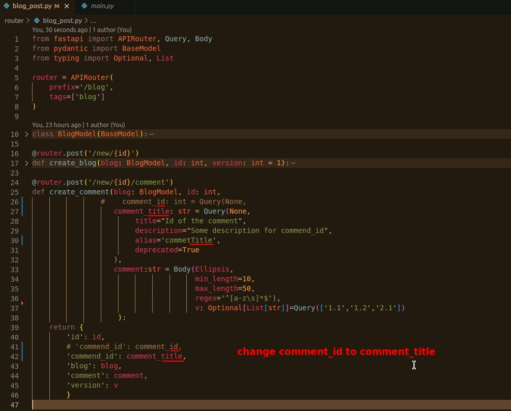
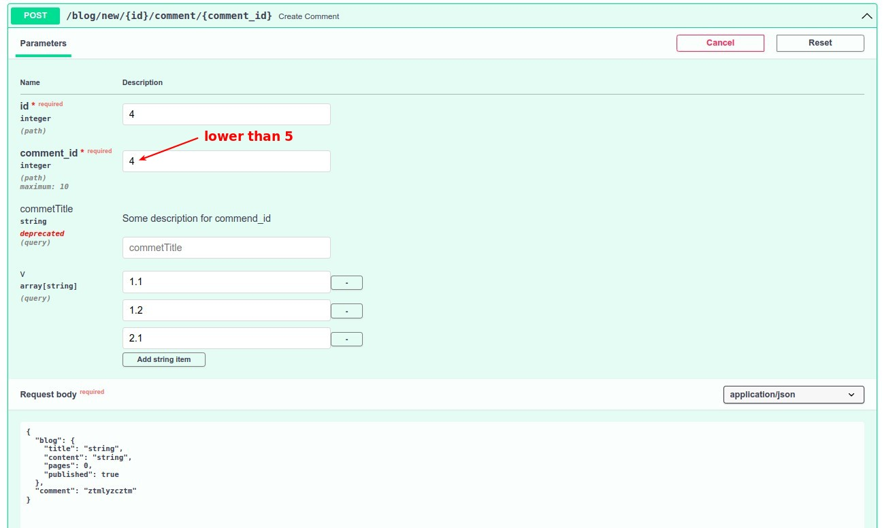

## **Prepare**

> Just making some adjustments to make more sense later...

## **Path param with number validations**

> In addition to the previously introduced string validations, there are of course validations for integers as well.

## **Test**

