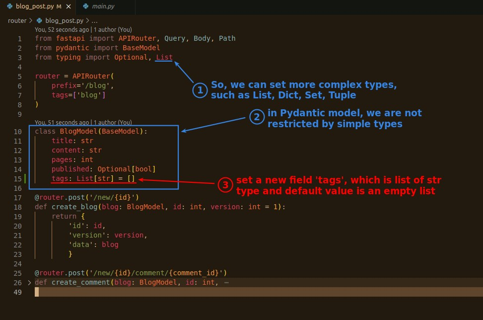
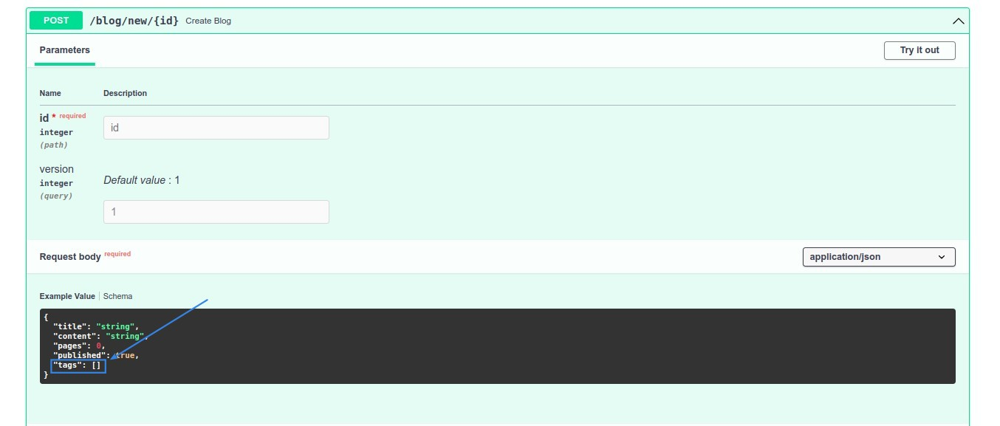
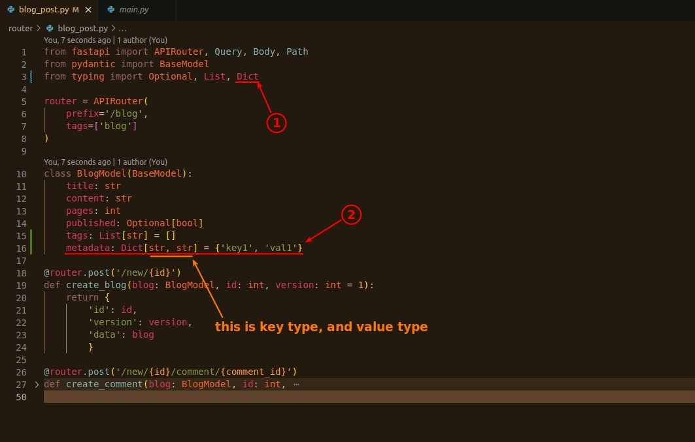
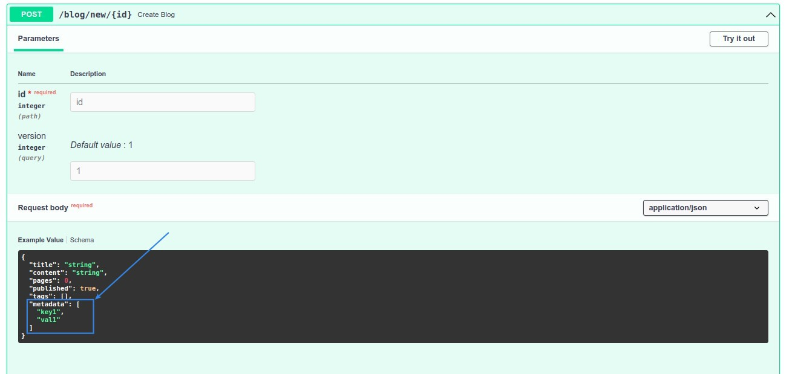
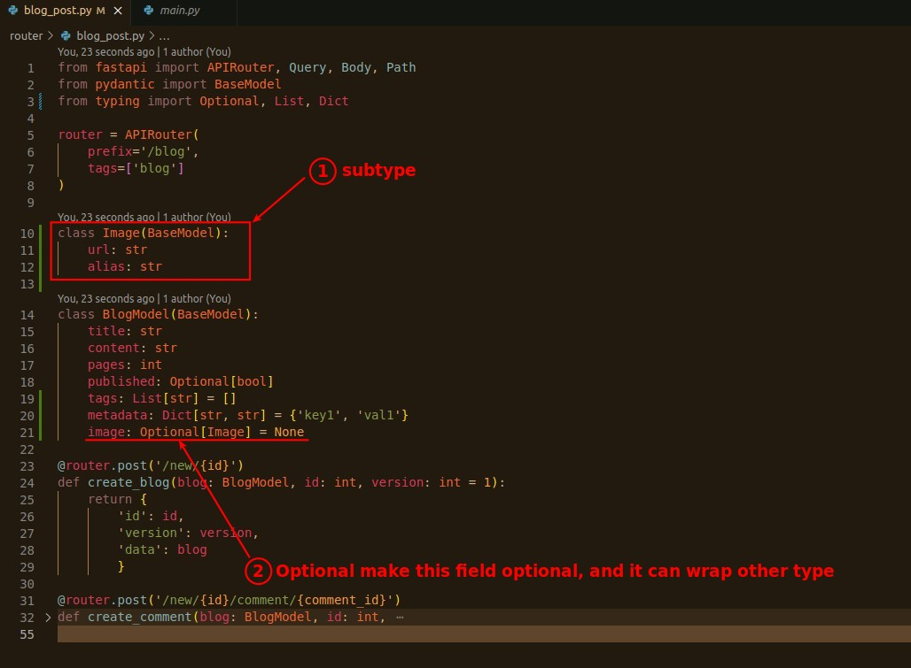
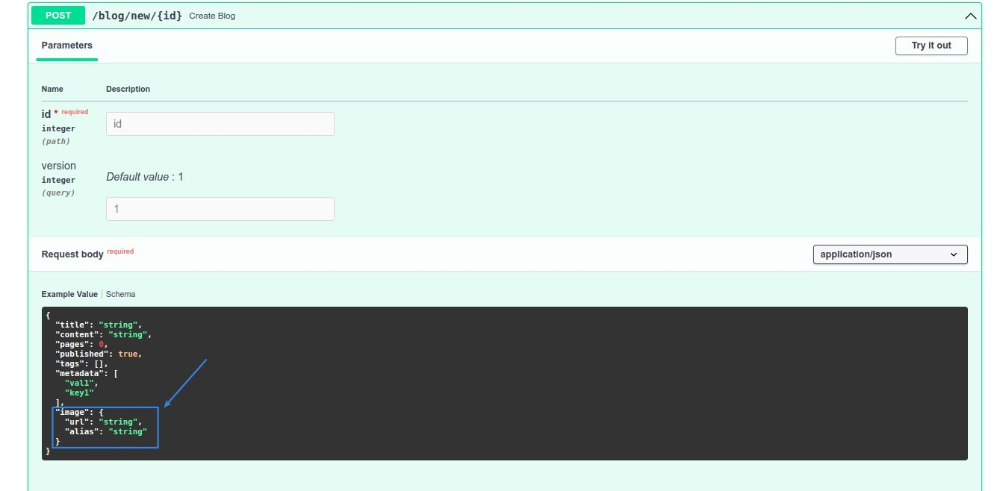

# **_Pydantic Model not restricted by simple types_**

## **List, Dict, Set, Tuple**

## **Complex subtype & Optional**

> We can use another model as type in one model, so that the other model is called complex subtype (only the naming is complex I think...)

- We can have multiple layers of model type.
