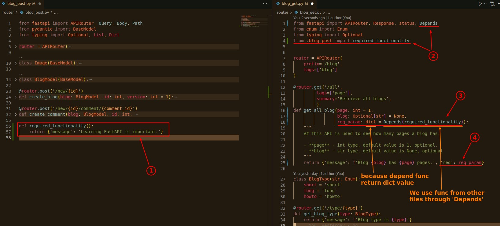
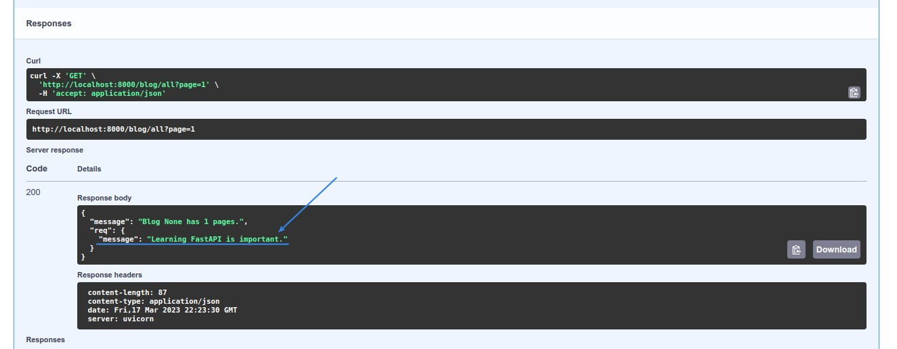

## **Depends**

> We can use it to use the function in other files. (but still need to import)

- If I already import this function, why don't I just use the function?
  - In Python, you can't use the function directly in the value position (unlike JS), you have to use 'Depends'.

