## **Checklist**

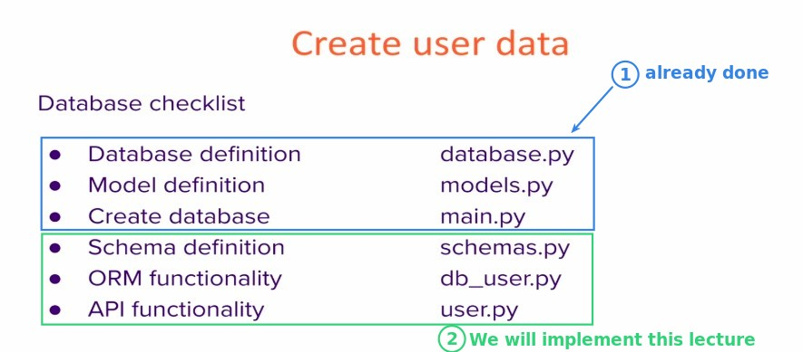

## **Request Schemas**

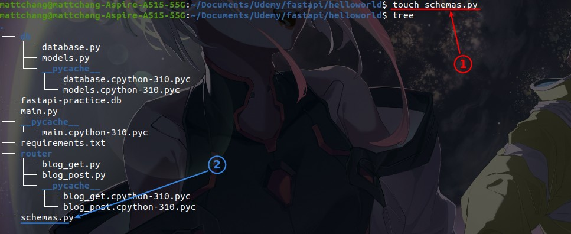

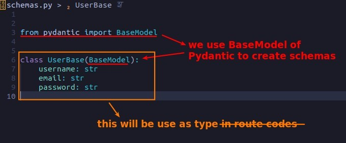

## **ORM Function**

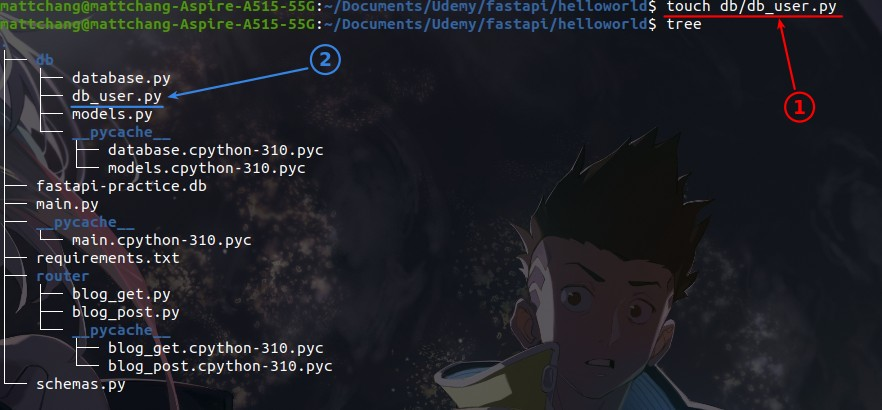

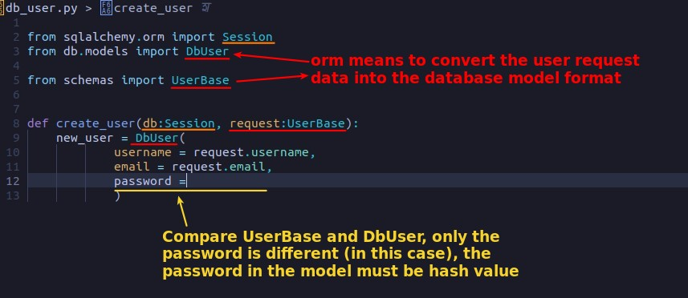

### _Hash_

> Need encryption and verification functions for password, we make them under a namespace.

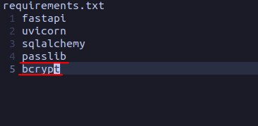

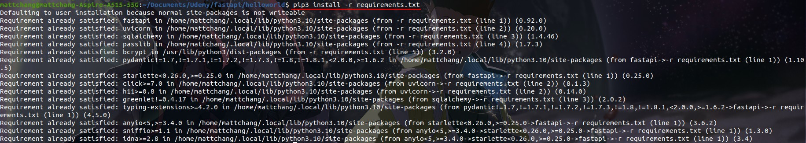

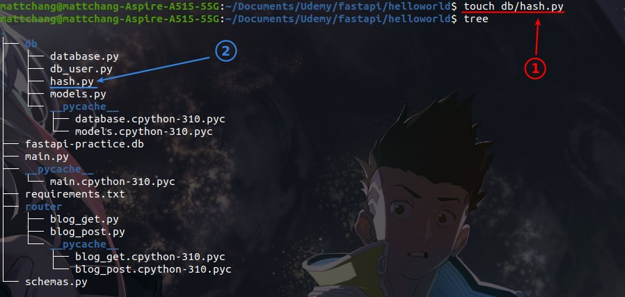

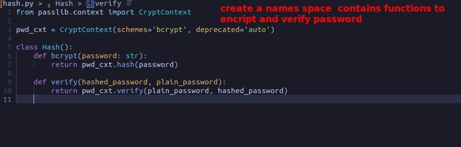

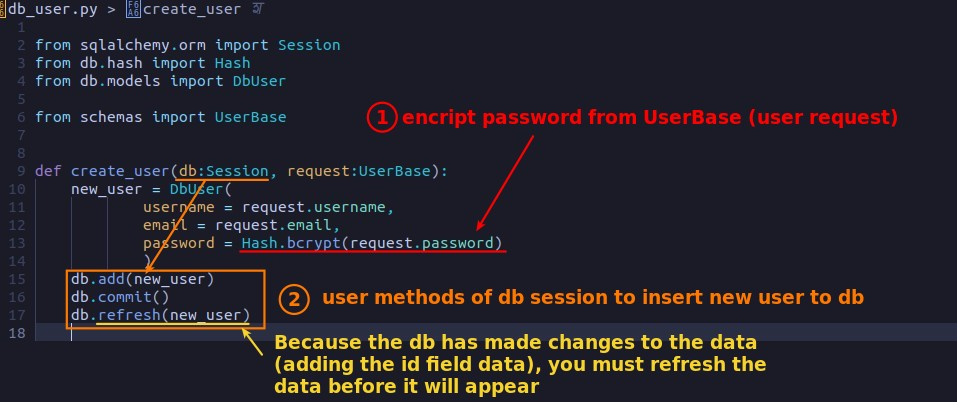

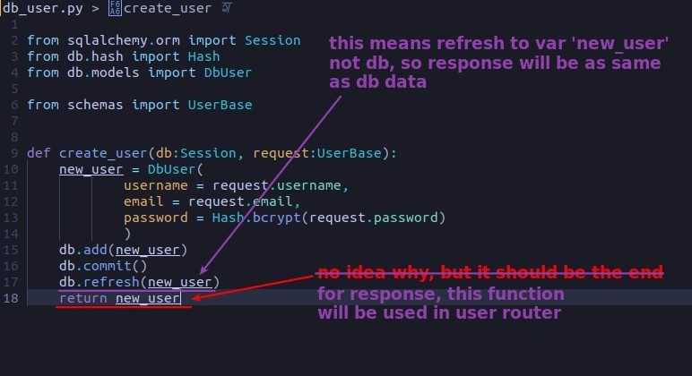

## **Router**

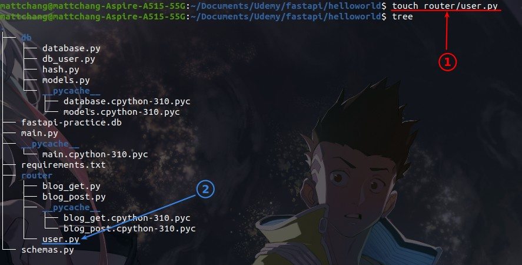

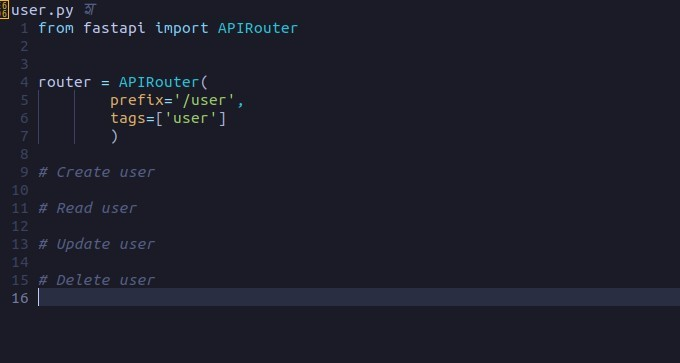

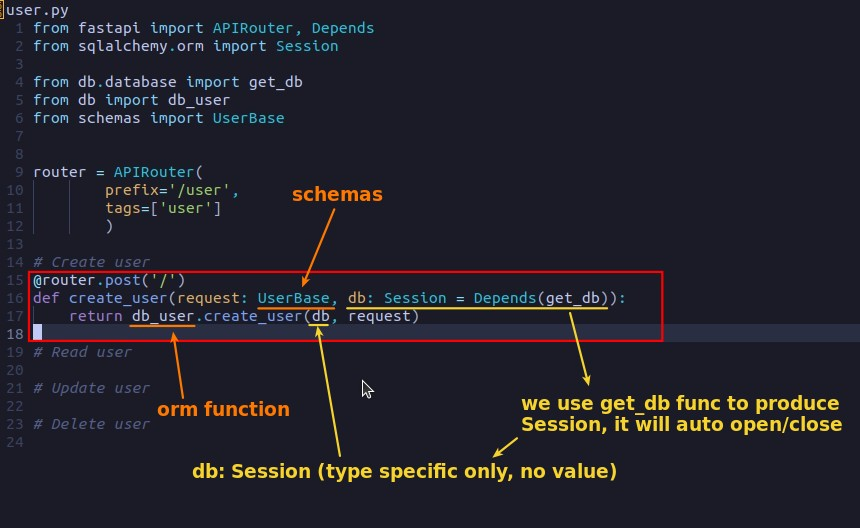

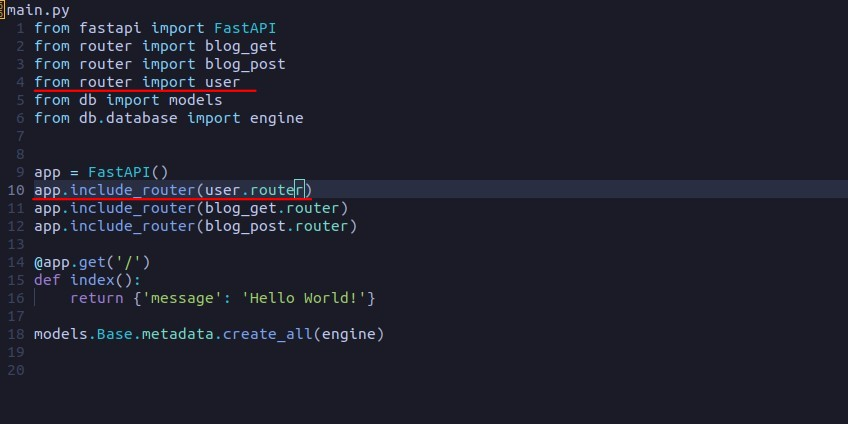

## **Test**

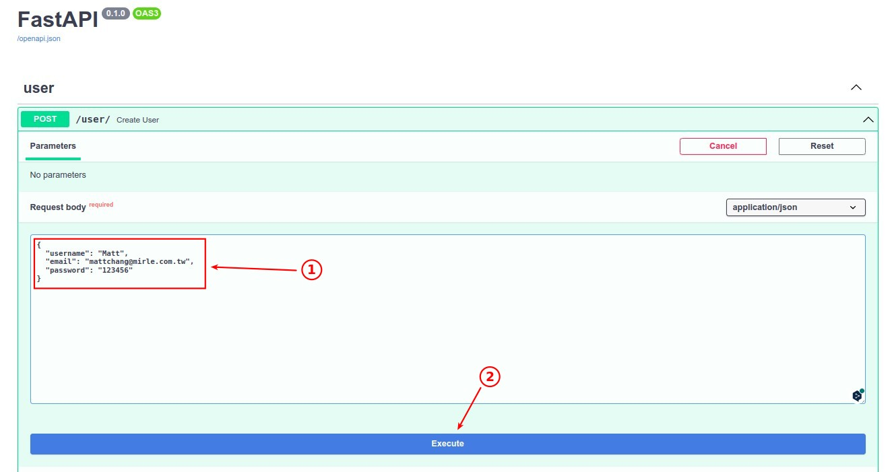

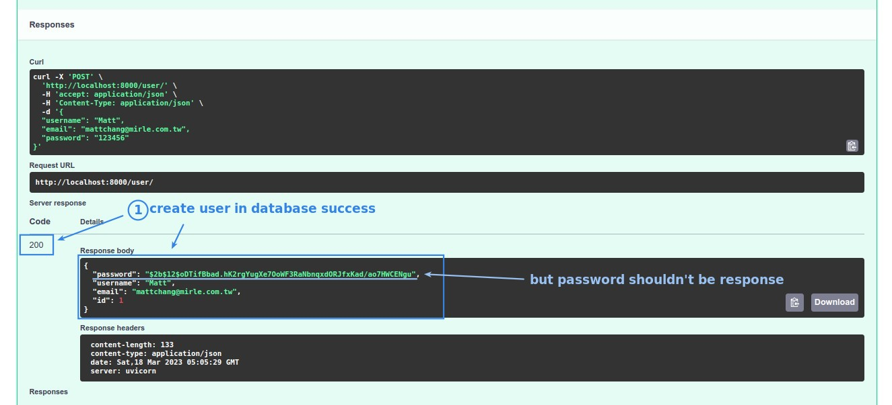

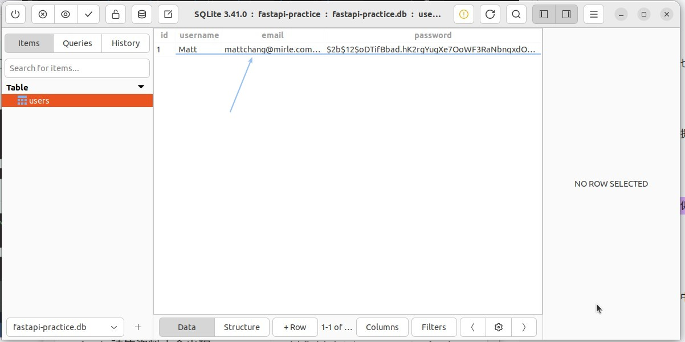

## **Response Schemas**

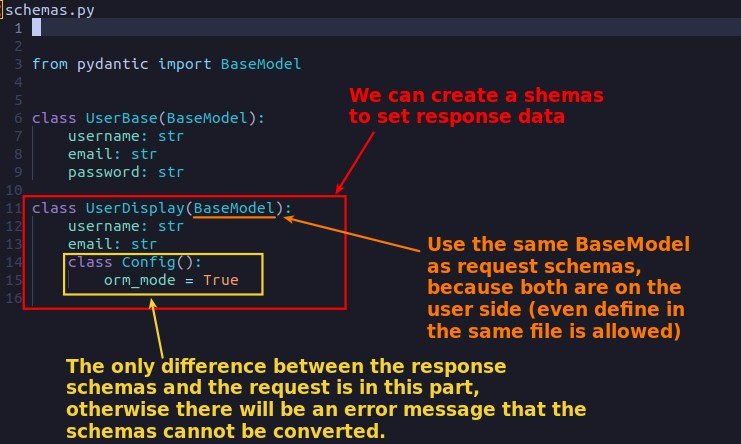

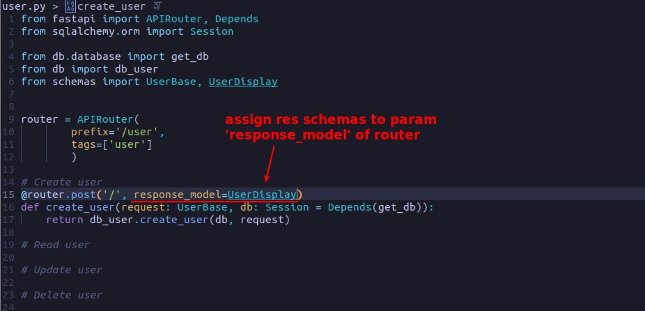

## **Final Test**

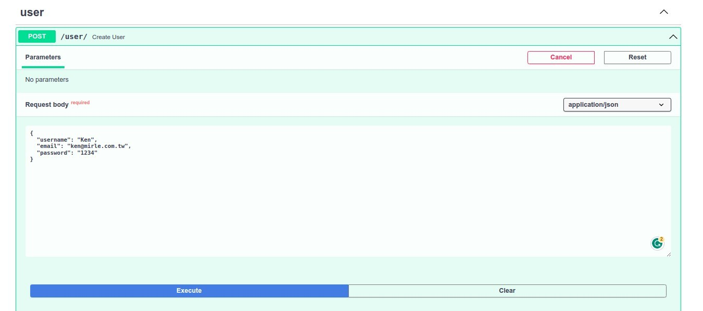

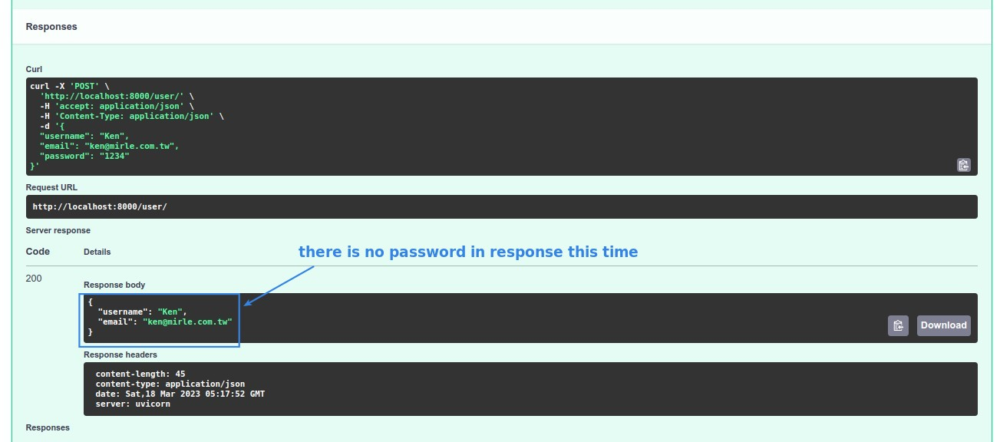
