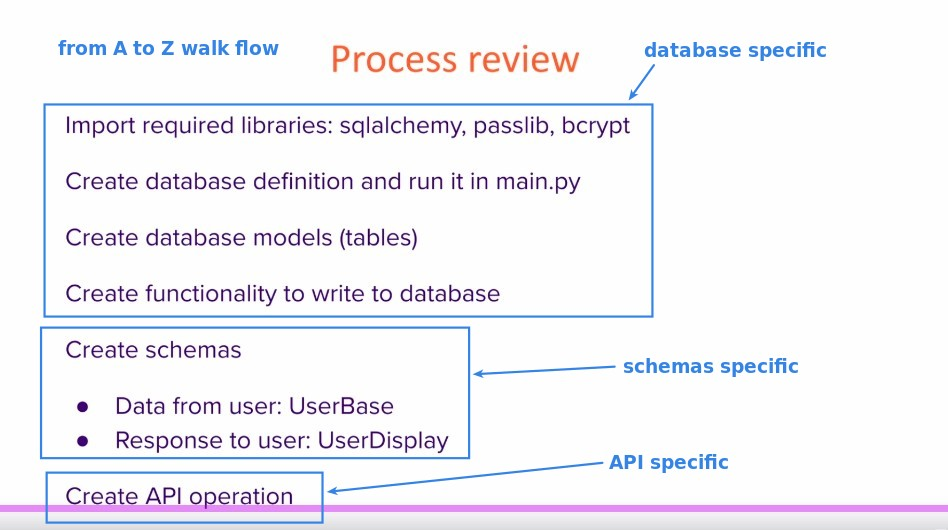
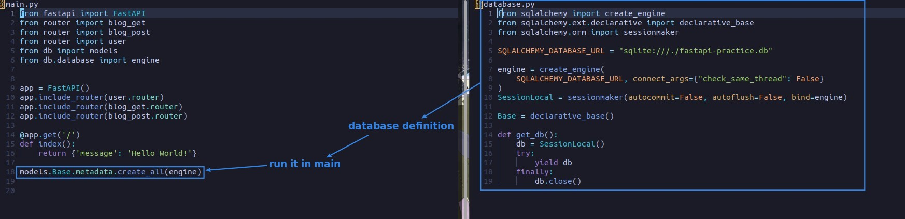
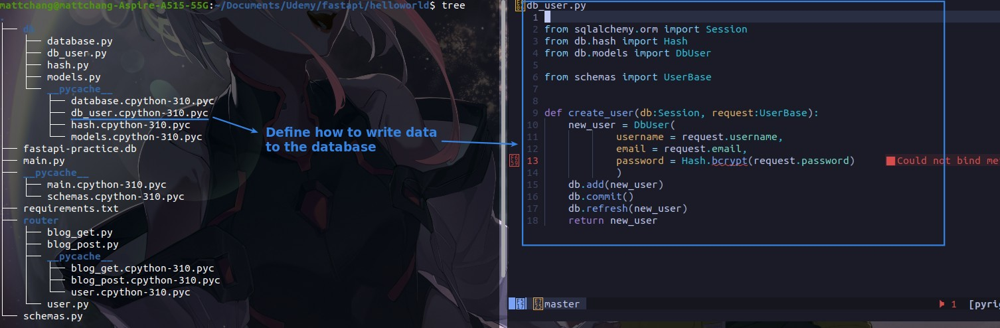
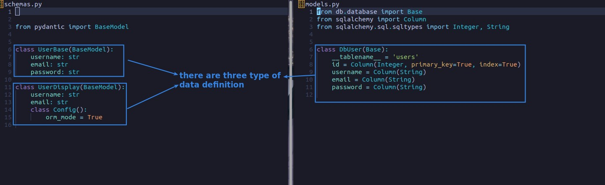
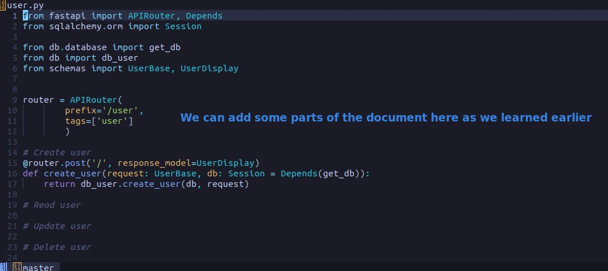

## **Process Review List**

> Let's review the process of our two previous lectures.

## **Database definition and Run it in main.py**

## **Define way to write data into Database**

## **There are three types of data definition**

- The constructor for the data type on the user side is different from that on the database side.

## **API, which is only FastAPI specific**

