## **What is exception**

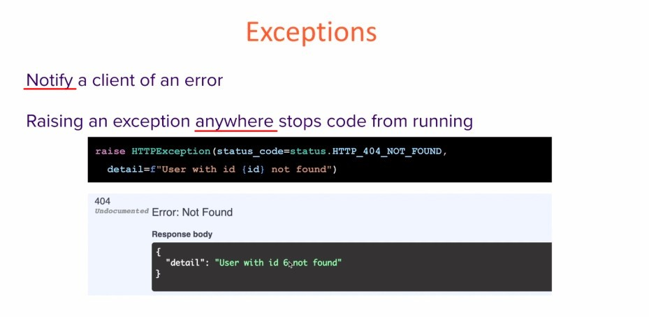

- Even if there are many layers, raising an exception at any one layer will abort the entire codes operation.

## **Use HTTPException to handler non-existed id**

> In some cases, even if we think it's an exception, we still get status code = 200, so we have to raise the exception manually to get the correct message to the client.

### _articles_

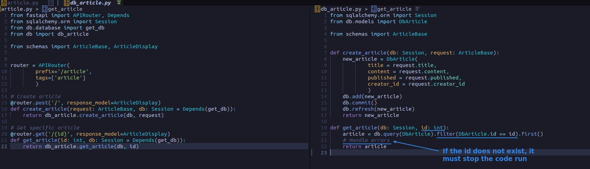

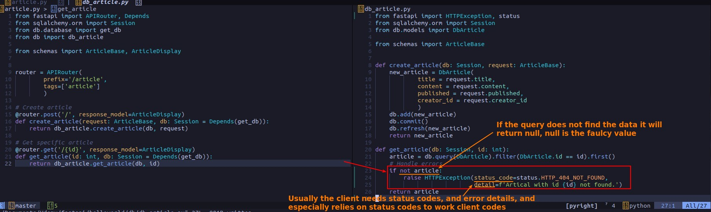

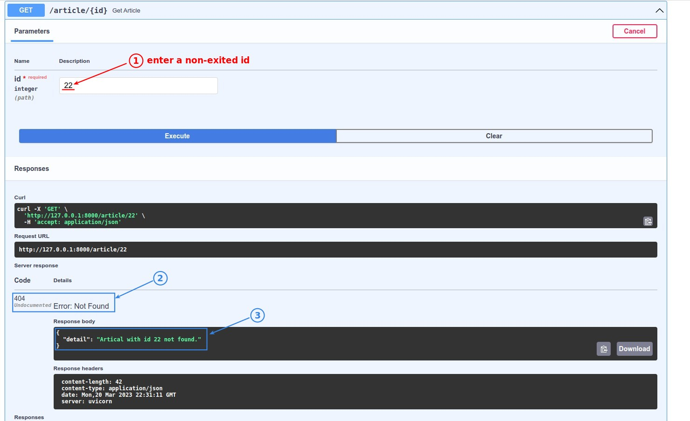

### _users_

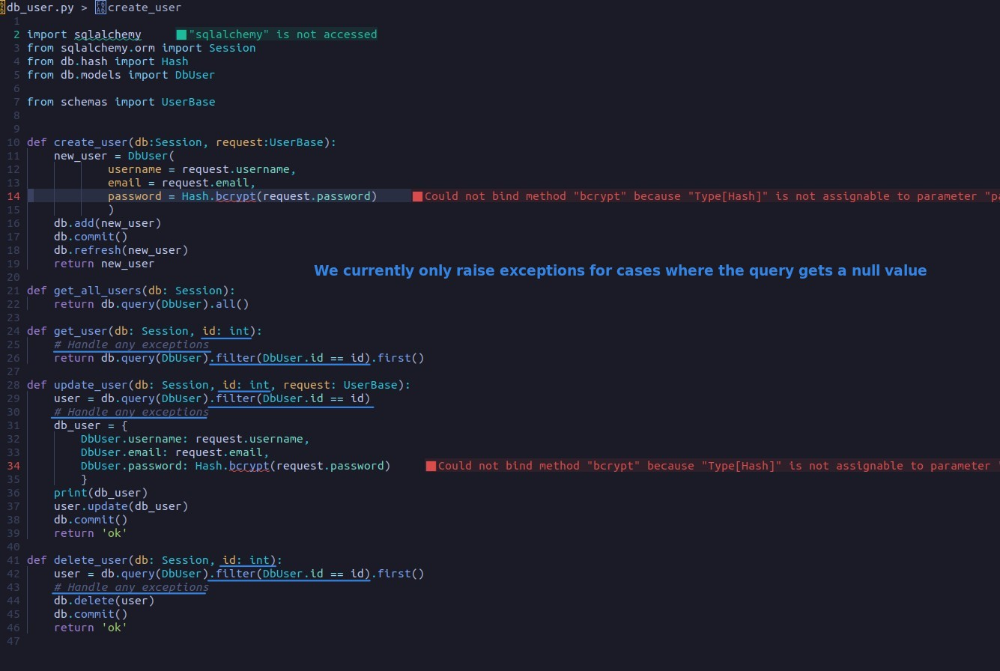

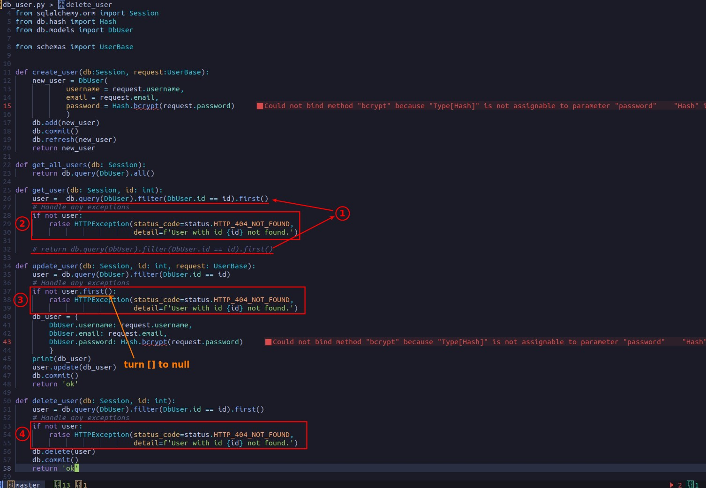

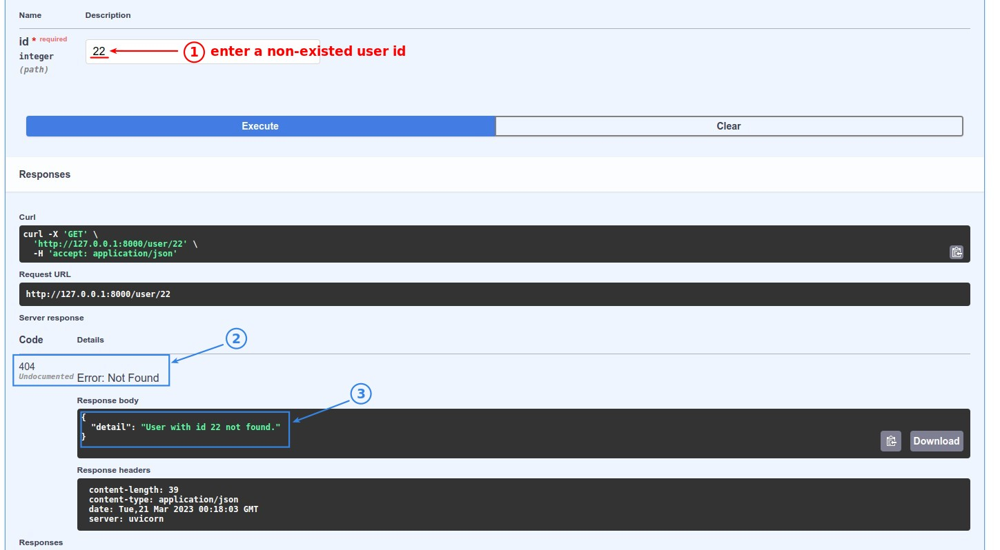

## **Custom Exception and its handler**

> Sometimes we need to do more specific things in the exception, we can customize the exception.

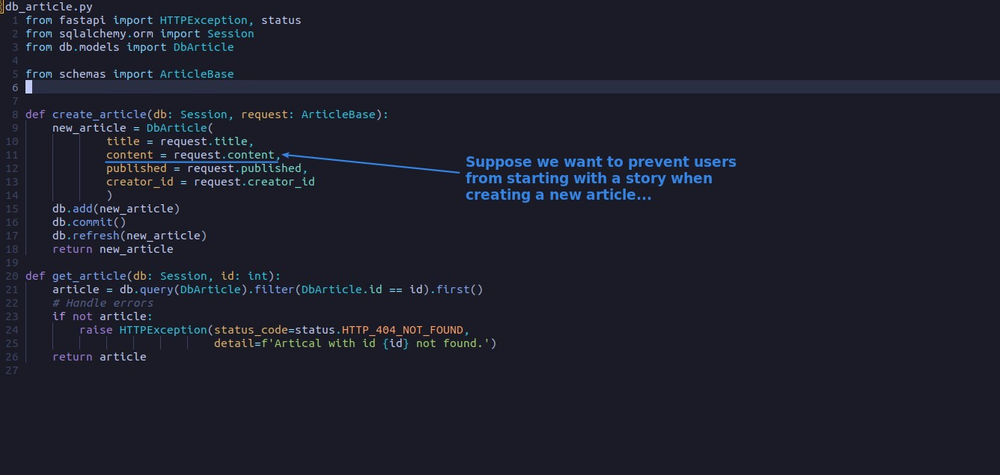

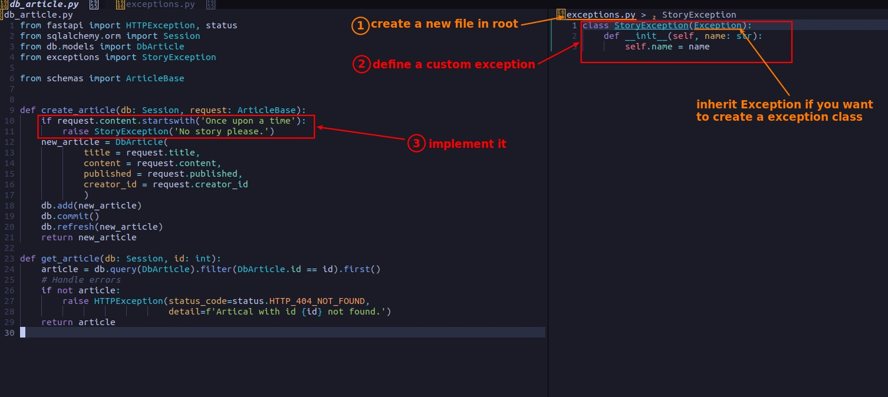

- We use a simple custom exception here for explanation, but in reality, custom exceptions are needed only when there are really special requirements, otherwise HTTPException is enough.

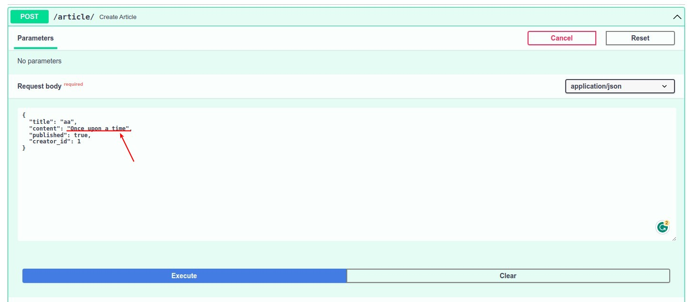

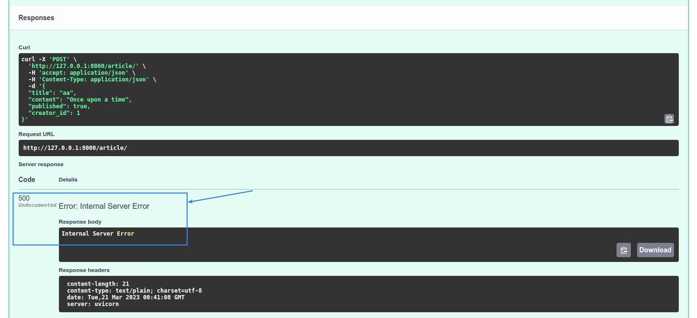

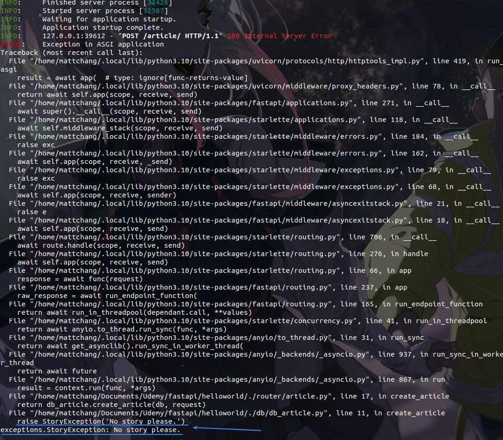

### _Exception Handler_

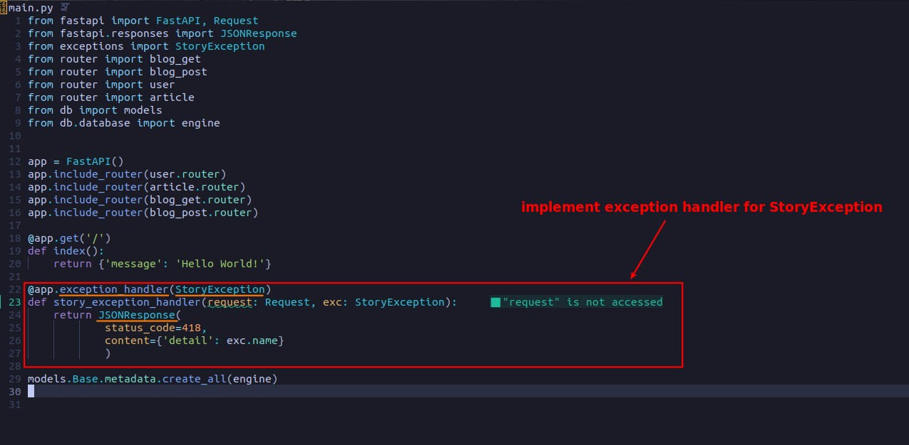

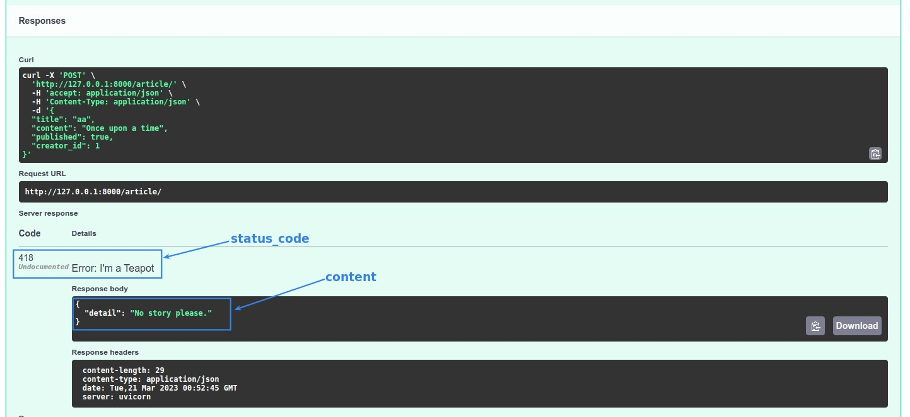

## **Custom handler for HTTPException**

> This will change the way most exceptions are handled except for custom exceptions.

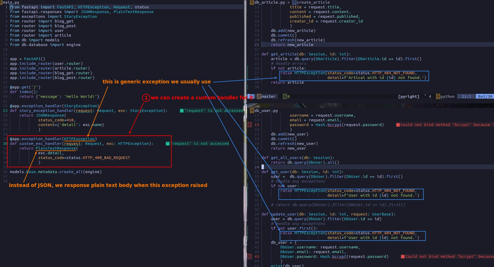

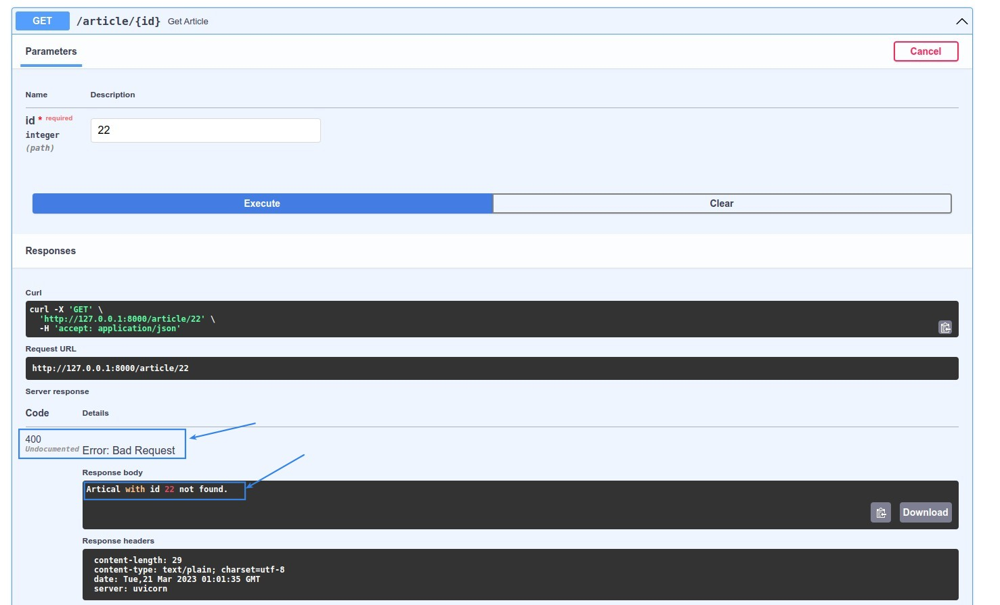
