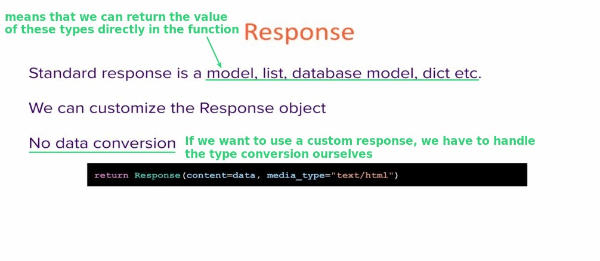

## **Intro of custom Response**

## **Practice of default response**

## **Response with text/palin media type**

## **Why we need to use custom response?**

## **HTMLResponse**

### _Write HTML data and test it_

### _return HTMLResponse_

## **PlainTextResponse**

## **Documents of responses**

