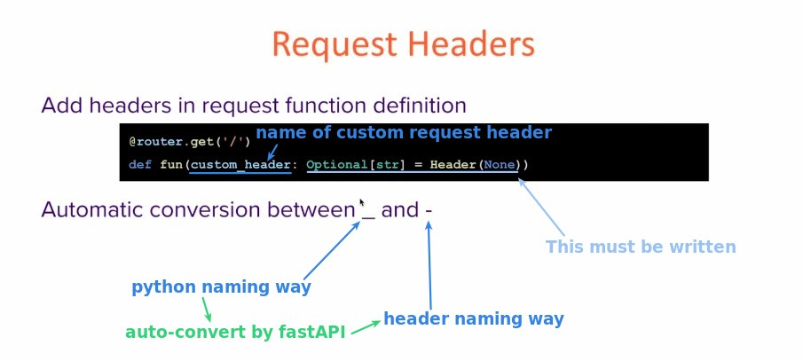
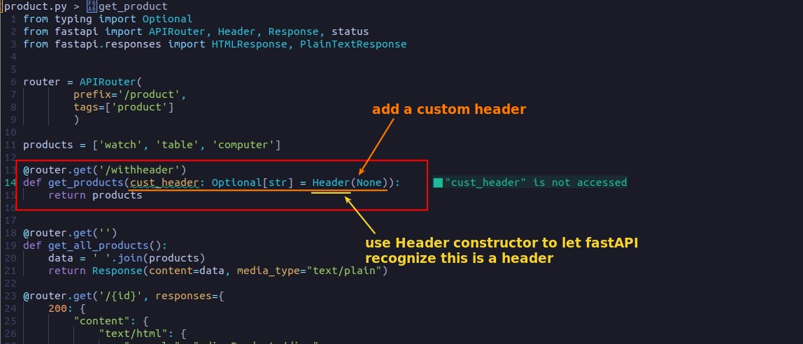
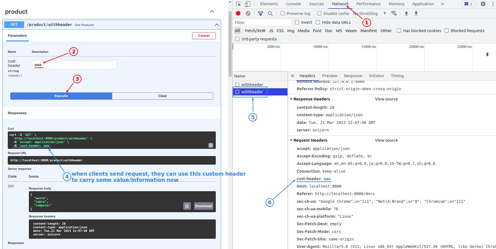
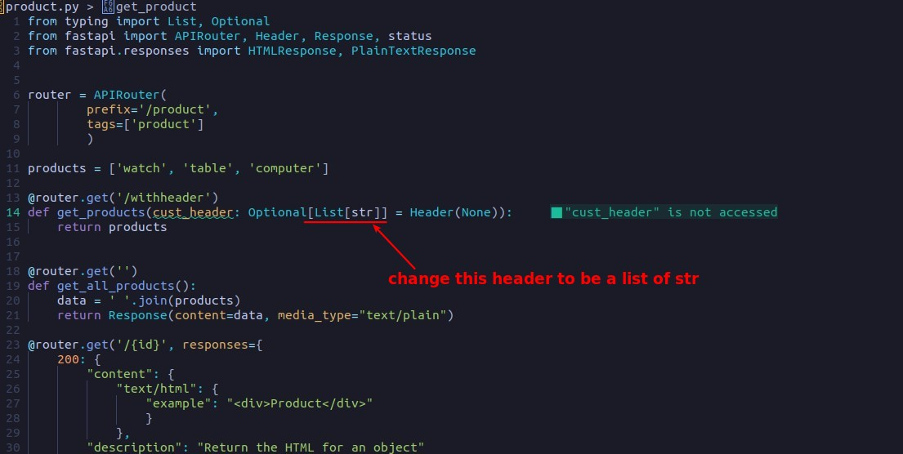
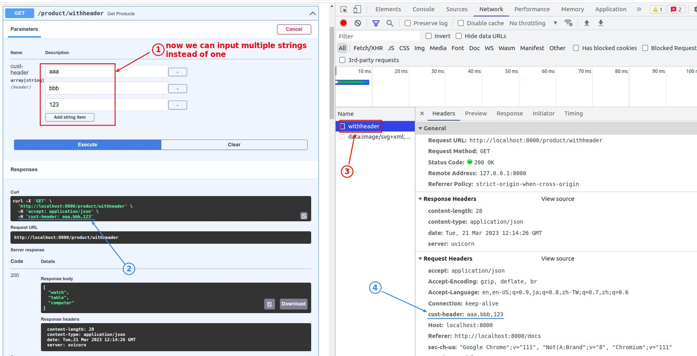
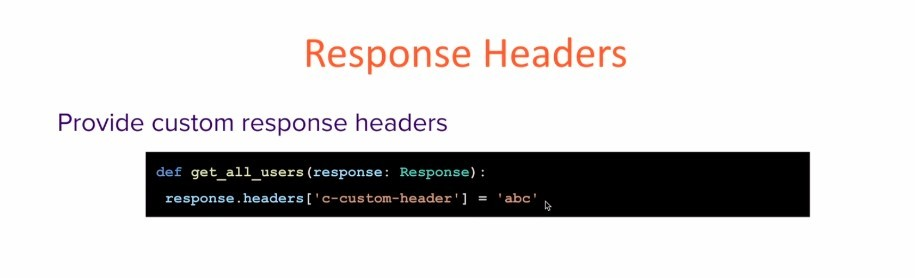
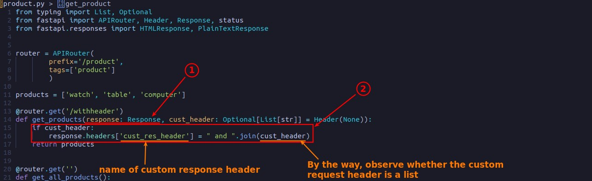
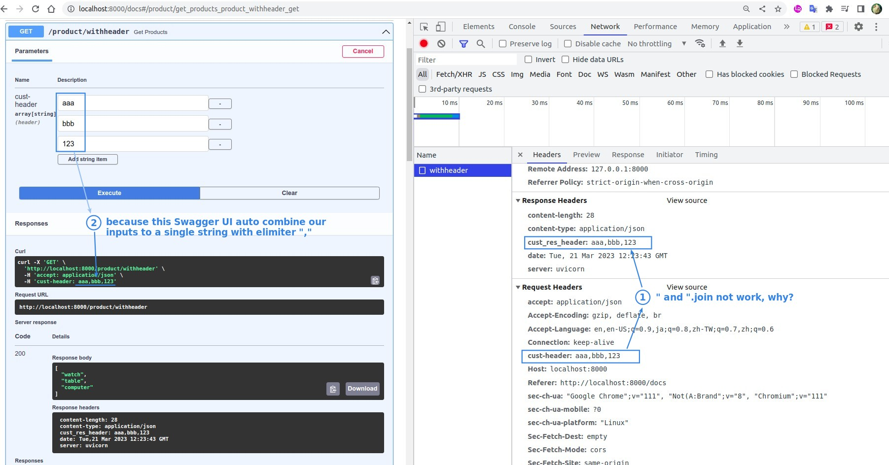
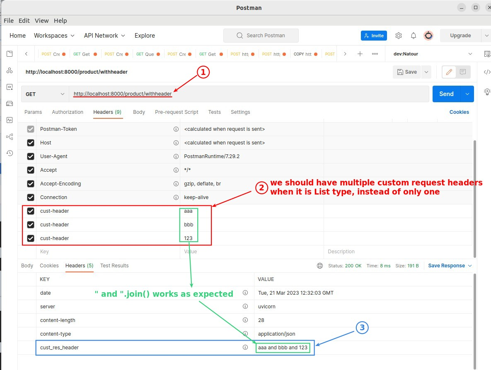

## **Request Headers**

### _Concept_

### _Coding_

### _Test_

### _List type_

### _Test_

## **Response Headers**

### _Concept_

### _Coding_

### _Test_

## **Slightly Issue of Swagger UI**

